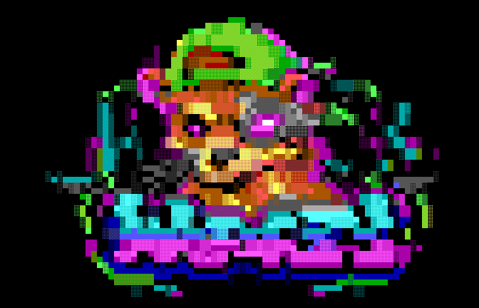

[we4zl-dialup.ans — terminal edition, UTF-8](docs/assets/we4zl-dialup.ans)

# WeazlCloud: The Sovereign Vault

A household library node built for metal you own. Your files, hosted on your
rig, without the cloud cartel. Mount the library natively via `davs://`. Keep
your accounts, encrypted vaults, and data exactly where they belong: in your
house. Bare metal, your own VM, or Docker—the node is yours.

## The Deck (Visuals & Acoustics)

Photos aren't just dumped in a directory. WeazlCloud builds a continuous
capture-date rail: drag to a month, pick a day, or scrub with your keyboard.
The timeline pages through a private metadata index and cached previews.
New uploads feed the same background indexing and preview pipeline as imports.

- **Triage:** Hover over a photo to reveal its selection circle, or choose
  **Select** (including on touch devices). Browsing does not select photos;
  **Cancel selection** or Escape returns to browsing. Shift-click ranges to bulk **Archive** (pull from the timeline)
  or **Hide** (keep out of normal Photos search and albums). Originals and album
  memberships remain. Hidden photos are still accessible through Library and
  use the same vault password.
- **Timeline Repair:** Date metadata screwed up? Open **Photos → ☰ → Repair dates**.
  Processing runs on the server with bounded memory, parallel readers and
  pause/resume controls. JPEG EXIF, Takeout sidecars, and capture dates supplied
  by mobile clients place photos on the timeline. Originals and owner corrections
  stay intact; missing dates stay **Unknown**, never the import date.
- **Acoustics:** **Library → Grid** reads MP3 ID3v2.2–2.4, FLAC, M4A, Ogg/Vorbis
  and Opus tags. Embedded artwork loads locally as you scroll. Audio streams
  through the server's metadata reader, without loading entire tracks into RAM
  or extracting temporary plaintext audio. Playback follows browser codec support.

Previews are generated in the background and cached encrypted.
New uploads preserve already displayed thumbnails instead of clearing the grid.
QuickTime `.mov` videos, including H.264/HEVC clips with a trailing movie index,
get poster thumbnails up to 256 MiB. Raster previews support up to 128 MP and
128 MiB; native formats retain a 64 MiB source bound. Each job must fit the
host’s preview memory budget, so smaller hosts can reject larger previews.
Original uploads and downloads have no corresponding size limit. Portrait playback fits inside the viewer;
playback codecs still depend on the browser.
**Photos → ☰ → Prepare previews** can prepare the existing collection; closing
the browser does not stop an accepted job. A locked vault or explicit pause
stops private work. Paired Live Photos open as a still, with motion playback
when you choose it. Open a **Live** photo and select **Loop motion**; **Stop motion**
returns to the still. Use **− / +** to zoom, drag an enlarged photo to pan, and
**Fit** to return to the window. Zoom also works during Live Photo playback.

See the [Photos API](docs/photo-api.md) and
[operations reference](docs/operations-reference.md) for formats, limits, and
recovery behavior.

## Cloud Liberation (The Corporate Data Heist)

Extracting your life from the Google monolith? WeazlCloud treats Takeout ZIPs
as prime heist material.

Transfer the ZIPs into the server's **Takeout staging directory**, exposed to
the container as a read-only import mount. Configure `WEAZLCLOUD_IMPORT_DIR`
and `WEAZLCLOUD_IMPORT_OWNER`, then unlock the owner's vault and start the import
from **Takeout**. Ordinary Library uploads store ZIPs as files; staging is what
feeds the importer.

Photos land under `/Photos`; Google Drive content lands at the Library root.
**Photos → Albums** reads Google's album JSON, rebuilds named albums, and adds
their descriptions. Later ZIP parts extend the same albums. Original media and
JSON sidecars remain in the library.

- **Encrypted Batching:** Up to eight small files feed the encrypted storage
  queue together. Files larger than 32 MiB stream individually, so massive
  videos, ISOs, and disk images stay out of application memory.
- **Conflict Handling:** Filename collisions preserve both versions. Incoming
  files get a stable `(takeout-…)` suffix; folder conflicts also get a separate
  destination. The audit records the mapping, and retries reuse it.
- **Resumable Ops:** If the heist gets interrupted, resume the import. WeazlCloud
  checks hashes of committed files and skips verified matches. Corrupt entries
  are logged so neighboring files can continue. Keep source ZIPs staged until
  verification is clean; archives with errors or conflicts require review before
  cleanup.

The [Takeout import guide](docs/google-takeout-import-2026-09-24.md) covers SFTP
staging, permissions, space planning, verification, and source ZIP cleanup.

## Dead Drops (Payload Delivery)

Forget shared-folder bureaucracy. No recipient accounts, no live collaboration
matrix. We use **Dead Drops**—called **grab links** and **capsules** in the UI/API.

A Dead Drop is a sealed, one-way payload with a dial-up soul. Mint it, wrap a
capability URL around it, and send it out of band. Editing your local file after
minting does **not** change the dropped payload. Want to send the new version?
Mint a new drop.

Files, folders, albums, and photo selections can become frozen drops. Folder
and bulk downloads use server-built ZIPs. Gallery guests can browse previews
without spending a grab; explicit original or ZIP downloads spend one.

### The Gates

- **Open:** The URL is the key. Use it when you trust the channel, such as scanning
  a QR code locally.
- **Passphrase:** The URL plus an out-of-band phrase. Send the phrase through a
  separate channel. Wrong phrase = no file. There is no phrase reset.

### Burn After Reading

Drops default to **one grab with a 24-hour expiry**, whichever limit is reached
first. You choose expiry and grab count when minting. Hit the limit, pass the
expiry, or select **Revoke**, and new downloads are denied. Burn cleanup removes
the unwrap material and sealed payload. The URL becomes a brick. Immortal public
links are a security hazard.

An already-admitted transfer can finish while the final grab burns; revocation
cancels active gallery transfers. An interrupted admitted download still spends
its grab. Ordinary on-demand ZIPs expire 90 minutes after preparation; capsule
ZIPs follow the drop's burn, expiry, or revocation.

*Sysop note:* Already-minted drops keep working when you lock your vault. The
share listener holds its own unwrap material alongside the sealed payload.
The QR code carries the same grab URL—show it in the room and go.

## Node Ops (Multiuser Foundation)

For native development with Go 1.25 or newer and Restic installed:

```sh
make check
make run
```

Native listeners bind to loopback by default:

| Listener | Address | Job |
| --- | --- | --- |
| Desk | `127.0.0.1:7272` | Library, Photos, local login, vault unlock, minting |
| Share | `127.0.0.1:7273` | Dead Drop delivery |
| Drive | `127.0.0.1:7274` | WebDAV |

Each listener exposes `/ready`. WebDAV mounts use `dav://HOST:7274/` for a direct
HTTP connection or `davs://HOST/` behind your HTTPS proxy, with your local account
credentials.

WeazlCloud runs a strictly local identity authority. No third-party identity
provider is needed. The first account on a fresh node becomes the sysop
administrator; new account requests require approval. Every user gets an
isolated vault, catalog, and, with the default backend, Restic library.
Administrator status does not grant another user's vault access in the app.
The host operator controls the stored key material and remains inside the vault
decryption trust boundary.

The administrator sets the public grab HTTPS hostname in **Admin** before
anyone can mint a drop. Users cannot replace that hostname. Route Desk and Share
on separate names via Traefik; the grab listener cannot serve the desk or unlock
vaults. WebDAV can stay private on the LAN.

### Docker

```sh
cp deploy/compose.env.example deploy/compose.env
# Edit for your host; preserve the existing data mount when upgrading.
docker compose --env-file deploy/compose.env -f deploy/compose.yaml config --quiet
docker compose --env-file deploy/compose.env -f deploy/compose.yaml up --build -d
```

Compose publishes no host ports by default. Attach the API service to your
reverse-proxy network or configure explicit port mappings. Set
`WEAZLCLOUD_SECURE_COOKIES=true` for HTTPS deployments. Vault/account passwords
do not belong in environment files.

The private photo worker has no network or vault mount. It receives authorized
media through a local socket, with separate CPU and memory limits. See the
[Compose guide](docs/docker-compose.md) for mounts, worker scratch space, proxy
routing, and upgrades that preserve existing vaults.

## Appendix: Sysop Tuning & Metal Specs

The node adapts to the effective resources of its host or container. The local
release smoke fixtures exercise a **2-CPU / 4-GiB** deployment; larger libraries
and heavier concurrent work need their own measurements.

- **Preview Rendering & Acceleration:** Docker ships a `libjpeg-turbo` helper
  for CPU-accelerated JPEG decoding, including scaled decode and runtime SIMD
  selection. The final bilinear resize is scalar. There is no AVX requirement.
  The JPEG helper uses pipes and writes no plaintext image files to disk.
  Set `WEAZLCLOUD_PREVIEW_RENDERER` to `auto` (default), `go` (Go rendering), or
  `turbo` (require the installed helper). The service stays CGO-free.
- **Memory Budgets:** Preview admission uses one eighth of effective
  host/container memory, capped at 8 GiB. Compressed server RAM cache bytes count
  against that allowance, with a ceiling of
  `min(2 GiB, effective RAM/64, preview budget/4)`. Admission estimates do not
  replace Docker's hard memory limit; keep the worker's container limit configured.
- **Worker Limits:** Override `WEAZLCLOUD_PREVIEW_BACKGROUND_WORKERS`,
  `WEAZLCLOUD_PREVIEW_TOTAL_WORKERS`, `WEAZLCLOUD_PREVIEW_SOURCE_READERS`, or
  `WEAZLCLOUD_PREVIEW_MEMORY_BYTES` when needed. Overrides remain within detected
  CPU/memory ceilings; photo concurrency uses at most half the effective CPU
  allocation, with a one-worker floor. Raster admission coalesces requests and
  caps outstanding distinct jobs at 256 across owners.
- **Mobile API & Outbox Sync:** The [mobile server API](docs/mobile-api.md)
  provides scoped device credentials with retry-safe rotation, one-way file
  backups, photo/album organization, and offline sync. Negotiated `parts-v1`
  uploads stage authenticated, encrypted chunks on the volume and finalize in
  bounded server workers after all components arrive. A durable processing
  record queues metadata and previews after the original is stored. Mobile
  clients should send the original capture date, including for HEIC and video.

Set `WEAZLCLOUD_PHOTO_SCHEDULE` in `deploy/compose.env` (or the service environment):

| Mode | Behavior |
| --- | --- |
| `balanced` | Default background allowance. |
| `fast` | Uses more of the photo allowance, reserving a foreground slot when multiple slots exist. |
| `quiet` | Pauses backlog generation; on-demand previews continue. |

All modes retain the same resource ceilings. A manually paused job stays paused
across restarts. See [operations and feature limits](docs/operations-reference.md),
the [preview helper](native/preview/README.md), and the
[recovery runbook](docs/photos-release-runbook.md) for the mechanics.

### Development Preview

The static mockup is the contract. The API is paint.

```sh
make mockup
```

Open [http://127.0.0.1:3001](http://127.0.0.1:3001), loopback only. Preview a
recipient's Dead Drop at
[http://127.0.0.1:3001/grab.html](http://127.0.0.1:3001/grab.html).
The static preview does not connect to a live vault.
